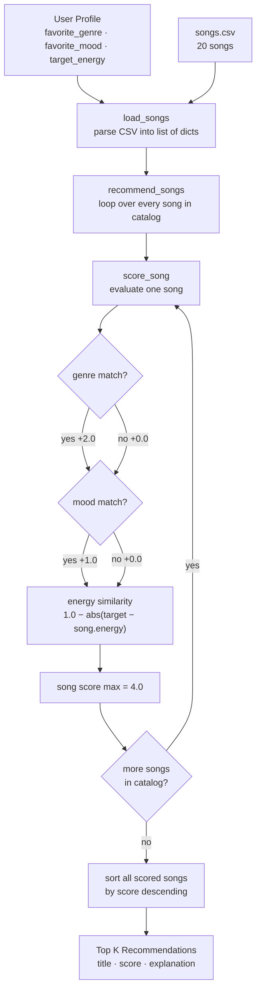
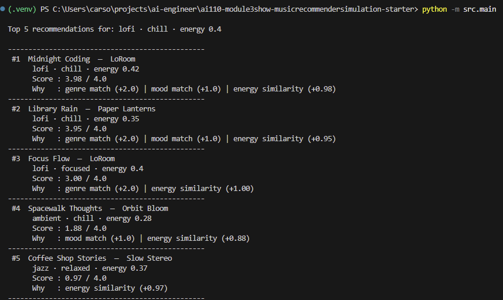
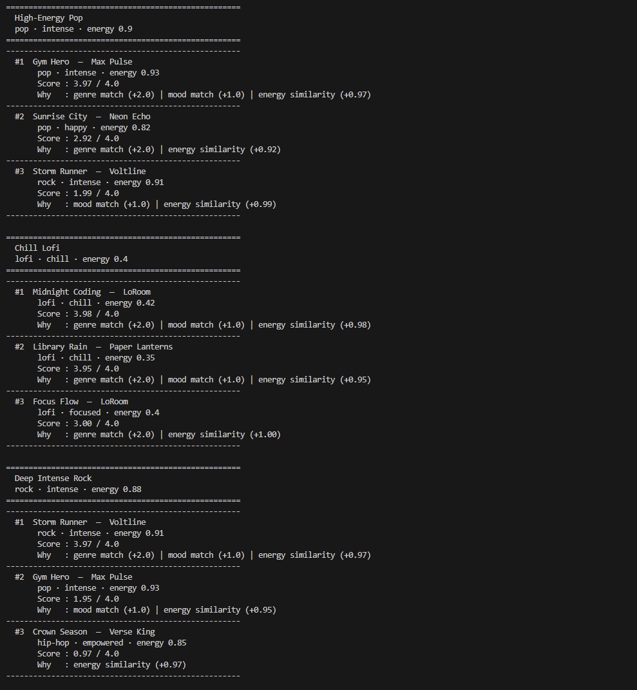
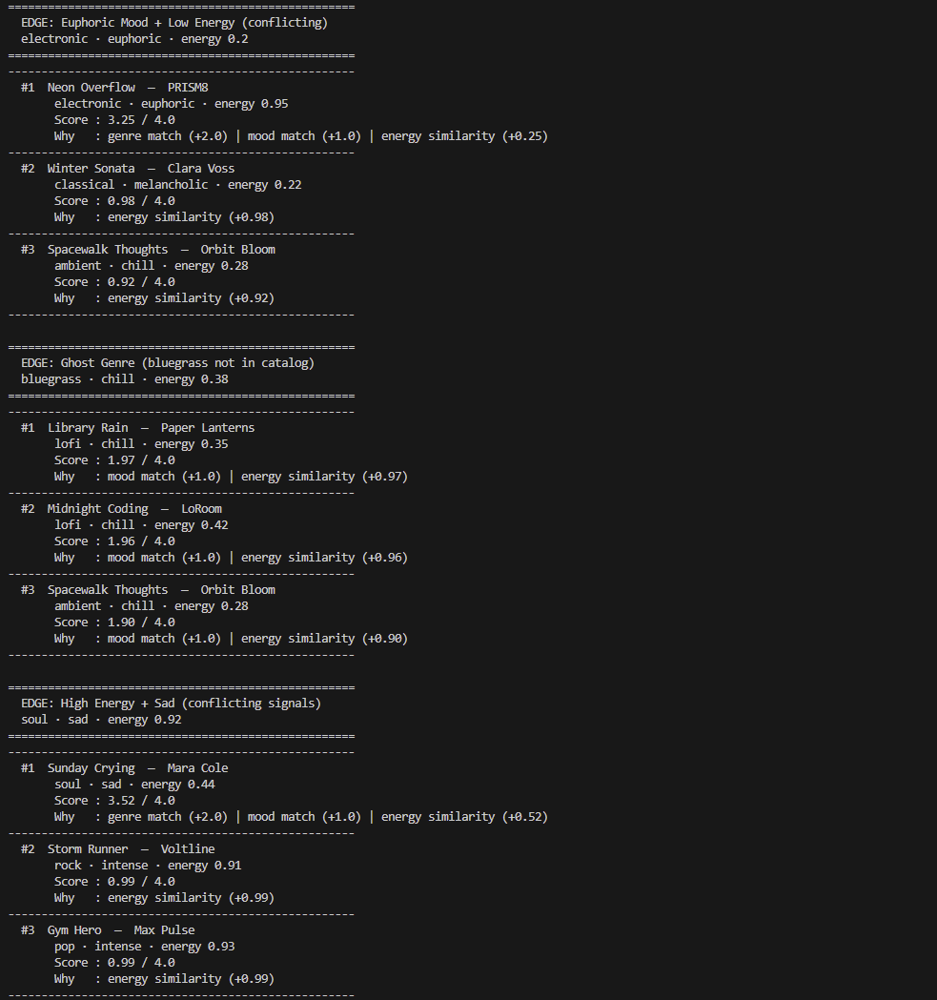

# 🎵 Music Recommender Simulation

## Project Summary

In this project you will build and explain a small music recommender system.

Your goal is to:

- Represent songs and a user "taste profile" as data
- Design a scoring rule that turns that data into recommendations
- Evaluate what your system gets right and wrong
- Reflect on how this mirrors real world AI recommenders

Replace this paragraph with your own summary of what your version does.

---

## How The System Works

Recommenders like Spotify learn from massive behavioral datasets. They track what millions of users skip, replay, or share, and find patterns across listeners with similar histories. Our simulation skips that data collection layer entirely. Instead of learning from behavior, we hand-code a scoring rule that directly compares a user's stated preferences against each song's attributes. This trades discovery power for transparency: every recommendation can be explained by a concrete reason, and no user history is required.

Our system prioritizes four features when scoring a song:

Song attributes used:
- `genre` — the musical category (e.g. lofi, pop, rock, ambient, jazz, synthwave, indie pop)
- `mood` — the emotional tone of the track (e.g. chill, happy, intense, moody, focused, relaxed)
- `energy` — a 0.0–1.0 measure of intensity; low energy feels calm, high energy feels driving or urgent
- `acousticness` — a 0.0–1.0 measure of how acoustic vs. produced/electronic the song sounds

User profile fields matched against those features:
- `favorite_genre` — the genre the user most wants to hear
- `favorite_mood` — the emotional tone the user is looking for right now
- `target_energy` — the energy level the user wants, as a 0.0–1.0 value
- `likes_acoustic` — a boolean indicating whether the user prefers acoustic or produced sounds

Each song is scored using this additive rule (max score: 4.0):

```
score = genre_match × 2.0
      + mood_match  × 1.0
      + (1.0 − |target_energy − song.energy|)
```

Genre is worth double a mood match because it encodes the broadest range of implicit preferences (instrumentation, production style, tempo) and is the strongest filter in a sparse catalog. Mood and energy are weighted equally as secondary signals that refine within a genre. Songs are then ranked by score descending and the top K are returned.

### Data Flow



### Algorithm Recipe

| Signal | Rule | Points |
|---|---|---|
| Genre match | `1` if `song.genre == favorite_genre` else `0`, × 2.0 | 0.0 or 2.0 |
| Mood match | `1` if `song.mood == favorite_mood` else `0`, × 1.0 | 0.0 or 1.0 |
| Energy similarity | `1.0 − abs(target_energy − song.energy)` | 0.0 – 1.0 |
| **Max total** | | **4.0** |

Genre carries the most weight because it acts as a hard filter — getting the wrong genre is a bigger miss than getting the wrong mood. A song in the right genre but wrong mood still scores 2.0+; a song in the wrong genre but right mood scores at most 2.0 on the other signals combined. Energy is always non-zero, ensuring continuous songs are never completely invisible.

### Expected Biases

- **Genre lock-in** — a user whose preferred genre has only one song in the catalog (e.g. `metal`, `reggae`) will always see that one song at the top regardless of how poorly it matches on mood or energy. Genre dominance becomes a liability in a sparse catalog.
- **No partial genre credit** — `indie pop` and `pop` score identically to `metal` and `pop` when the user wants `pop`: both return 0. Semantically similar genres are treated as completely different.
- **Energy mid-point pull** — songs with energy near 0.5 are never far from any user's `target_energy`, so they consistently earn ~0.5 energy points. Extreme-energy users (target near 0.0 or 1.0) are penalized by a catalog that skews toward mid-range songs.
- **Mood and acousticness are unlinked** — the scoring ignores `acousticness` entirely, meaning a user who strongly prefers acoustic production has no way to express that preference in the score.

### Terminal Output



### Normal Outputs



### Edge Cases



---

## Getting Started

### Setup

1. Create a virtual environment (optional but recommended):

   ```bash
   python -m venv .venv
   source .venv/bin/activate      # Mac or Linux
   .venv\Scripts\activate         # Windows

2. Install dependencies

```bash
pip install -r requirements.txt
```

3. Run the app:

```bash
python -m src.main
```

### Running Tests

Run the starter tests with:

```bash
pytest
```

You can add more tests in `tests/test_recommender.py`.

---

## Experiments You Tried

Use this section to document the experiments you ran. For example:

- What happened when you changed the weight on genre from 2.0 to 0.5
- What happened when you added tempo or valence to the score
- How did your system behave for different types of users

---

## Limitations and Risks

Summarize some limitations of your recommender.

Examples:

- It only works on a tiny catalog
- It does not understand lyrics or language
- It might over favor one genre or mood

You will go deeper on this in your model card.

---

## Reflection

Read and complete `model_card.md`:

[**Model Card**](model_card.md)

Write 1 to 2 paragraphs here about what you learned:

- about how recommenders turn data into predictions
- about where bias or unfairness could show up in systems like this


---

## 7. `model_card_template.md`

Combines reflection and model card framing from the Module 3 guidance. :contentReference[oaicite:2]{index=2}  

```markdown
# 🎧 Model Card - Music Recommender Simulation

## 1. Model Name

Give your recommender a name, for example:

> VibeFinder 1.0

---

## 2. Intended Use

- What is this system trying to do
- Who is it for

Example:

> This model suggests 3 to 5 songs from a small catalog based on a user's preferred genre, mood, and energy level. It is for classroom exploration only, not for real users.

---

## 3. How It Works (Short Explanation)

Describe your scoring logic in plain language.

- What features of each song does it consider
- What information about the user does it use
- How does it turn those into a number

Try to avoid code in this section, treat it like an explanation to a non programmer.

---

## 4. Data

Describe your dataset.

- How many songs are in `data/songs.csv`
- Did you add or remove any songs
- What kinds of genres or moods are represented
- Whose taste does this data mostly reflect

---

## 5. Strengths

Where does your recommender work well

You can think about:
- Situations where the top results "felt right"
- Particular user profiles it served well
- Simplicity or transparency benefits

---

## 6. Limitations and Bias

Where does your recommender struggle

Some prompts:
- Does it ignore some genres or moods
- Does it treat all users as if they have the same taste shape
- Is it biased toward high energy or one genre by default
- How could this be unfair if used in a real product

---

## 7. Evaluation

How did you check your system

Examples:
- You tried multiple user profiles and wrote down whether the results matched your expectations
- You compared your simulation to what a real app like Spotify or YouTube tends to recommend
- You wrote tests for your scoring logic

You do not need a numeric metric, but if you used one, explain what it measures.

---

## 8. Future Work

If you had more time, how would you improve this recommender

Examples:

- Add support for multiple users and "group vibe" recommendations
- Balance diversity of songs instead of always picking the closest match
- Use more features, like tempo ranges or lyric themes

---

## 9. Personal Reflection

A few sentences about what you learned:

- What surprised you about how your system behaved
- How did building this change how you think about real music recommenders
- Where do you think human judgment still matters, even if the model seems "smart"

